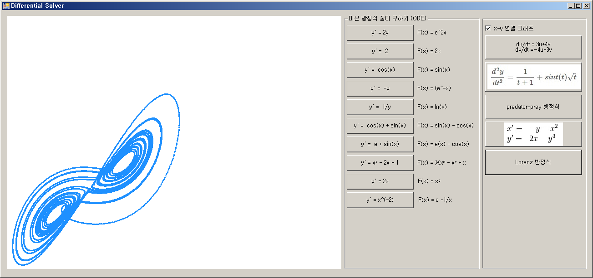

# Calculus

Calculus

 Differential Solver

상미분 방정식을 롱게쿠타 방식으로 풀이하여 그래프로 그려줍니다.

2D / x-y 연결형 그래프를 그릴 수 있습니다.

Lorenz System

Predator Prey

+ Runge–Kutta methods : https://en.wikipedia.org/wiki/Runge%E2%80%93Kutta_methods

+ 구현 후 Graph 검증 : https://www.wolframalpha.com/

+ predator–prey equations : https://en.wikipedia.org/wiki/Lotka%E2%80%93Volterra_equations

+ Lorenz System : https://en.wikipedia.org/wiki/Lorenz_system

2020 Coded by GwangSu Lee
